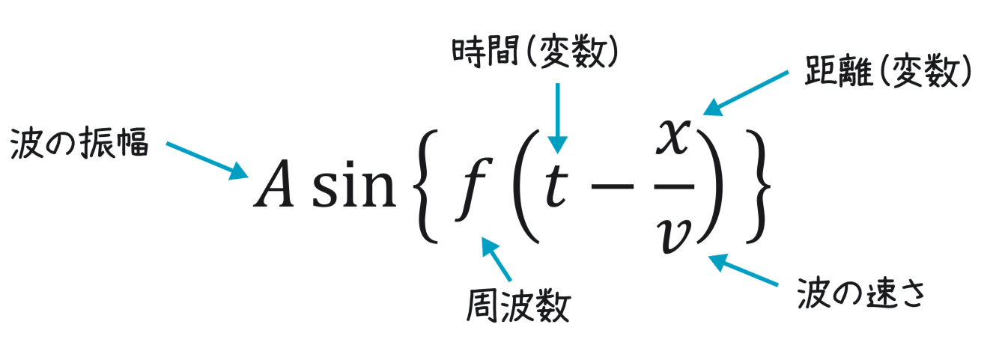

# 三角関数

## 三角関数の定義

直角三角形における垂線を$a$、底辺を$b$、斜辺を$c$とすると、

$$
\sin \theta = \frac{a}{c}, \,\,
\cos \theta = \frac{b}{c}, \,\,
\tan \theta = \frac{a}{b}
$$

## 主な公式

$$
\tan \theta = \frac{\sin \theta}{\cos \theta}
$$

$$
\sin ^2 \theta + \cos ^2 \theta = 1
$$

## 加法定理

$$
\sin (\alpha \pm \beta) = \sin \alpha \cos \beta \pm \cos \alpha \sin \beta
$$

$$
\cos (\alpha \pm \beta) = \cos \alpha \cos \beta \mp \sin \alpha \sin \beta
$$

$$
\tan (\alpha \pm \beta) = \frac{\tan \alpha \pm \tan \beta}{1 \mp \tan \alpha \tan \beta}
$$

## 波

波は三角関数を使って以下のように表すことができる

    

