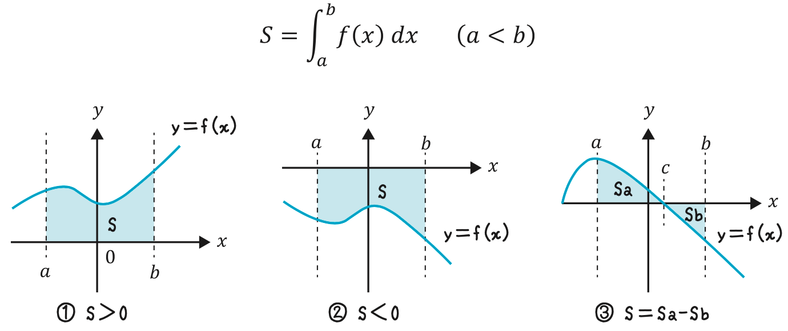
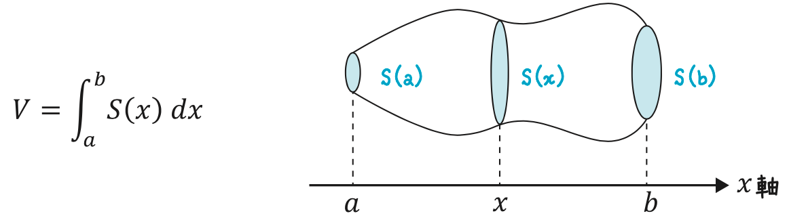

# 積分

積分とは、

- 無限を使った掛け算の和
- 面積を求める手段

## 積分

関数$f(x)$の区間$a \leq x \leq b$において、$y = f(x)$と$x$軸、直線$x=a$と$x=b$で囲まれた領域の面積$S$は以下のように表せる

$$
S = \int_a^b f(x) {\rm d} x
$$

## 不定積分

- $f(x) = F'(x)$を満たす原始関数$F(x)$を求めること
- 式中の$C$は積分定数

$$
\int x^a {\rm d} x = \frac{x^{a+1}}{a+1} + C
$$

$$
\int \frac{1}{x} {\rm d} x = \log | x | + C
$$

$$
\int \sin x {\rm d} x = - \cos x + C
$$

$$
\int \cos x {\rm d} x = \sin x + C
$$

$$
\int \tan x {\rm d} x = - \log | \cos x | + C
$$

$$
\int {\rm e}^x {\rm d} x = {\rm e}^x + C
$$

$$
\int a^x {\rm d} x = \frac{a^x}{\log a} + C
$$

$$
\int \log x {\rm d} x = x \log x - x + C
$$

## 定積分

$f(x)$の区間$a \leq x \leq b$における定積分は原始関数$F(x)$として下記のように計算できる

$$
\int_a^b f(x) {\rm d} x = \left [ F(x) \right ]_a^b = F(b) - F(a)
$$

    

## 体積

立体をx軸に対して垂直な平面で切ったときの断面積を$S(x)$とすると、この立体の体積は下式で求められる

$$
V = \int _a^b S(x) {\rm d}x
$$

    

