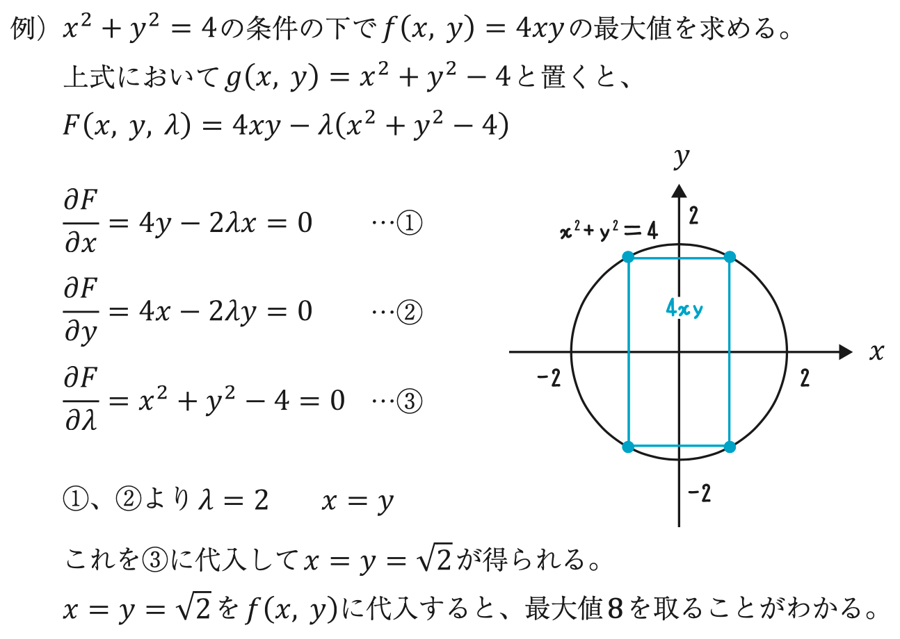
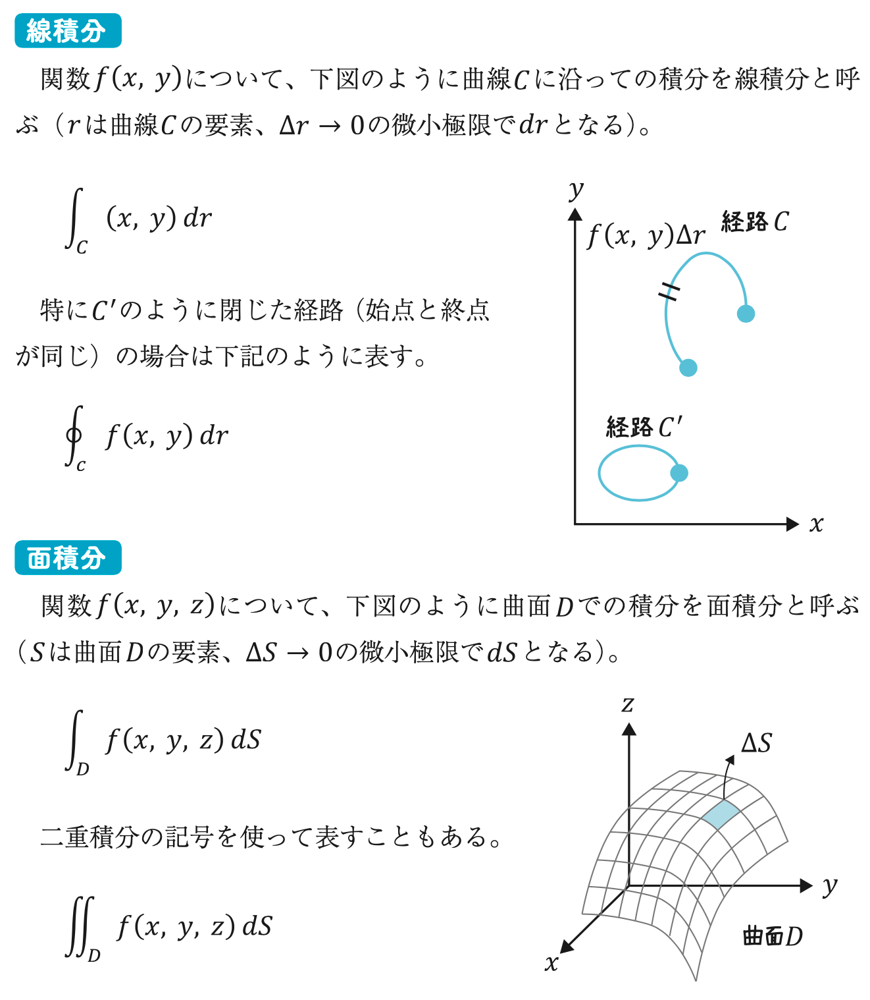

# 微分方程式

- 微分方程式の解は**関数**であり、数値ではない
- 未知関数の導関数を含む関数方程式を**微分方程式**という
    - ex) 微分方程式$\frac{{\rm d}x}{{\rm d}t} = x$の解は$x = C {\rm e}^t$（$C$は積分定数）
- 世の中の物理法則の多くが微分方程式で表現されている

# ラプラス変換

関数$f(t)$について、下式で定義された関数$F(s)$を関数$f(t)$の**ラプラス変換**という

$$
F(s) = \int _0^{\infty} f(t) {\rm e} ^{-st} {\rm d} t
$$

# 逆ラプラス変換

関数$F(s)$から元の関数$f(t)$を計算することを**逆ラプラス変換**という

$$
f(t) = \lim _{p \rightarrow \infty} \frac{1}{2 \pi i} \int _{c-ip}^{c+ip} F(s) {\rm e} ^{st} {\rm d} s
$$

# 偏微分

多変数関数$z = f(x, y)$において、特定の文字以外を定数とみなして微分することを**偏微分**という

$$
\frac{\partial z}{\partial x}, \,\, \frac{\partial z}{\partial y}
$$

# 全微分

多変数関数$z = f(x, y)$において、関数値の増分${\rm d}z$をそれぞれの増分${\rm d}x$と${\rm d}y$を用いて表すことを**全微分**という

$$
{\rm d}z = \frac{\partial z}{\partial x} {\rm d} x + \frac{\partial z}{\partial y} {\rm d} y
$$

# ラグランジュの未定乗数法

ある条件下で、多変数関数の最大値や最小値を求める方法

$x$、$y$が条件$g(x, y) = 0$を満たしながら動くとき、$z = f(x, y)$が最大、最小となる$x$、$y$では、下式が成り立つ

$$
F(x, y, \lambda) = f(x, y) - \lambda g(x, y) \\
\frac{\partial F}{\partial x} = \frac{\partial F}{\partial y} = \frac{\partial F}{\partial \lambda} = 0
$$

## 例題

    

## ポイント

- ラグランジュの未定乗数法は簡単で便利なテクニックである
- $\lambda$が何を意味するのか、直感的に理解することが難しい
- 理屈が気になっても、まずはテクニックとして習得すべし
- 変数が3個以上あっても、条件が複数あっても使える汎用性が高い方法
- ただし、得られた結果はあくまで最大値、最小値を取る候補であって、それが最大値、最小値を取ることを保証するものではない

# 線積分・面積分

    

