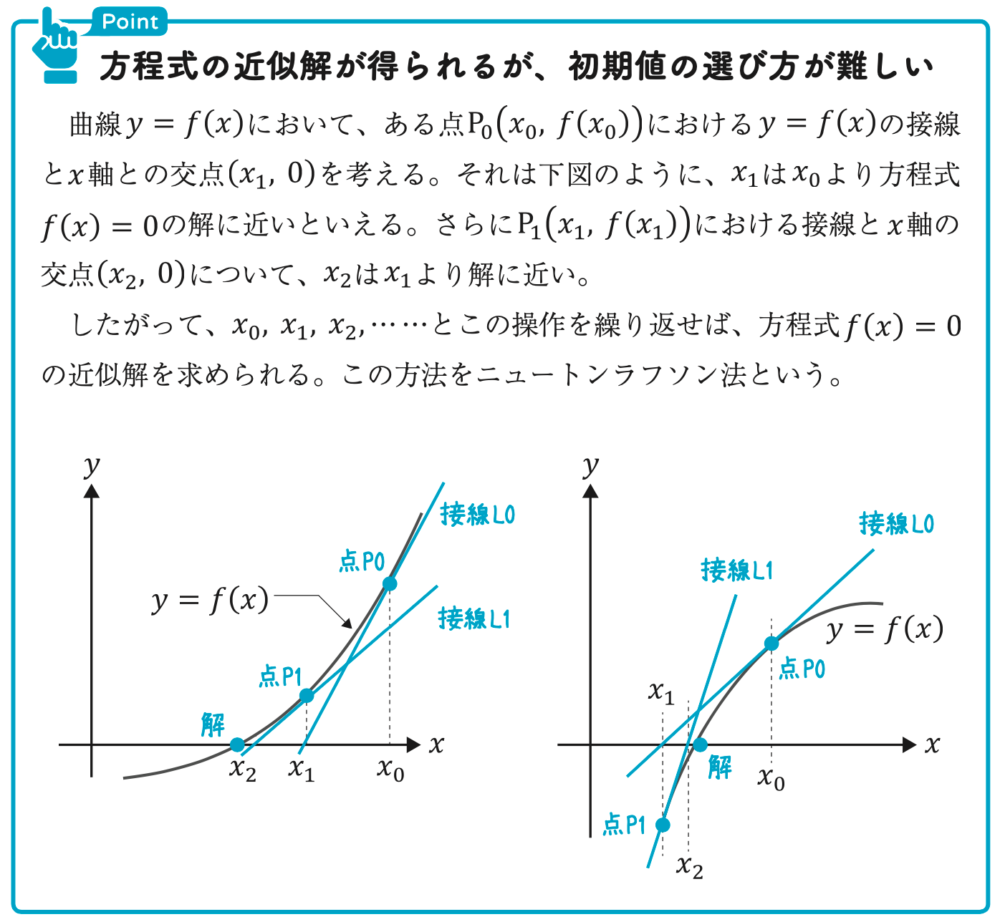
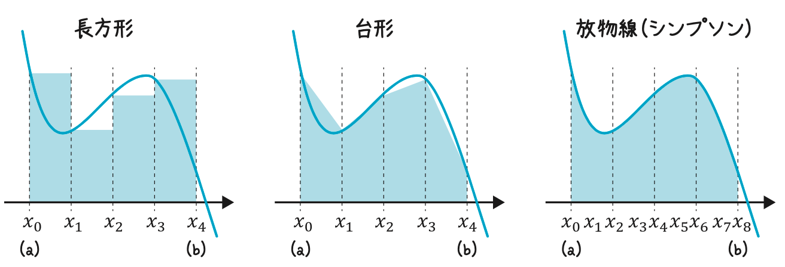
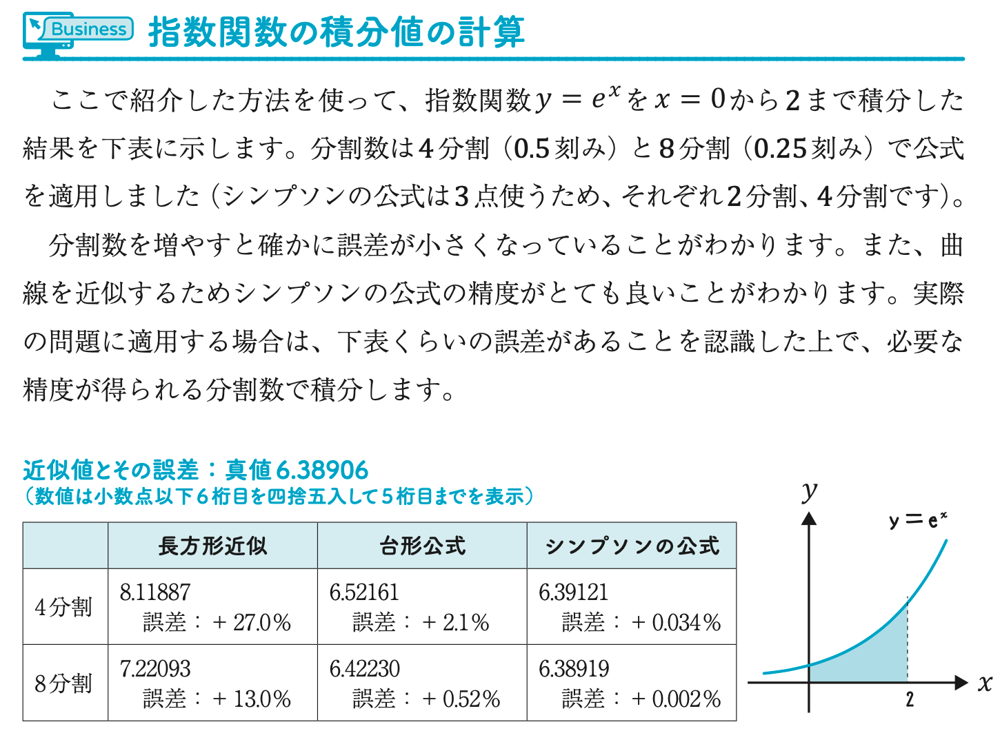

- 数学の式変形で得られた解を**解析解**という
- 数値解析で近似的に得られた解を**数値解**という
- 積分は一般的に解析解の計算はできないため、数値解で計算する必要がある
- 数値には必ず誤差が含まれるため、その**誤差を評価すること**が重要

# 1次の近似

関数のある小さな区間を関数の接線で近似する方法

関数$f(x)$において、$x \fallingdotseq a$のとき、下記のように近似できる

$$
f(x) \fallingdotseq f(a) + f'(a)(x-a)
$$

## 例

$f(x) = x^2$を$x=2$の近くで近似

$$
f(x) \fallingdotseq 4 + 4(x - 2) = 4x - 4
$$

# テイラー展開・マクローリン展開

関数のある小さな区間を直線で近似する方法

## テイラー展開

ある関数$f(x)$について、下式のように$(x - a)^n$の多項式として展開できる

$$
f(x) = f(a) + f'(a)(x-a) + \frac{1}{2!}f''(a)(x-a)^2 + \frac{1}{3!}f'''(a)(x-a)^3 + \cdots \\
 = \sum _{n=0}^{\infty} \frac{1}{n!} f^{(n)}(a) (x-a)^n
$$

## マクローリン展開

$a=0$でテイラー展開したもの

$$
f(x) = f(0) + f'(0)x + \frac{f''(0)}{2!}x^2 + \frac{f'''(0)}{3!}x^3 + \cdots \\
 = \sum _{n=0}^{\infty} \frac{f^{(n)}(0)}{n!} x^n
$$

## ポイント

- 関数を$(x-a)^n$という単純な関数の和で表現できる
    - 四則演算のみ
    - ${\rm e}^{2.5}$を数値計算するのも展開して計算できる
- 各項の分母にn!(階乗)がある
    - 高次の項は事実上無視することができる

# ニュートンラフソン法

    

# 数値微分

小さい区間の平均変化率をそのまま微分係数とする。

関数$y = f(x)$を$x = a$で微分する。

## 前進差分

$$
f'(a) = \frac{f(a+h) - f(a)}{h}
$$

## 後進差分

$$
f'(a) = \frac{f(a) - f(a-h)}{h}
$$

## 3点近似

$$
f'(a) = \frac{f(a+h) - f(a-h)}{2h}
$$

# 数値積分

関数$y = f(x)$の$x = a$から$b$までの積分値$S = \int_a^b f(x) {\rm d} x$は、分割数$n$（シンプソンの公式は$2n$）で以下のように計算できる

## 長方形近似

$$
\frac{b - a}{n} \left ( f(x_0) + f(x_1) + \cdots + f(x_{n-1}) \right )
$$

## 台形近似

$$
\frac{b - a}{2n} \left ( f(x_0) + 2 ( f(x_1) + f(x_2) + \cdots + f(x_{n-1})) + f(x_n) \right )
$$

## シンプソンの公式（放物線近似）

$$
\frac{b - a}{6n} \left ( f(x_0) + 4 ( f(x_1) + f(x_3) + \cdots + f(x_{2n-1})) + 2 ( f(x_2) + f(x_4) + \cdots + f(x_{2n-2})) + f(x_{2n}) \right )
$$

    
    

# オイラーの公式

微分方程式の解法として一番基礎的だが、精度がイマイチ

関数の増分を接線を使って近似している

微分方程式$\frac{{\rm d} y}{{\rm d} x} = f(x, y)$を数値的に解くときに、差分$x_{n+1} - x_n$を$h$として、$y_n$を以下のように求める

$$
y_1 = y_0 + h f(x_0, y_0) \\
y_2 = y_1 + h f(x_1, y_1) \\
\cdots \\
y_{n+1} = y_n + h f(x_n, y_n)
$$
