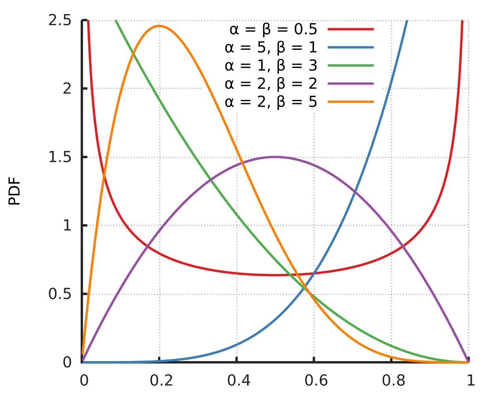
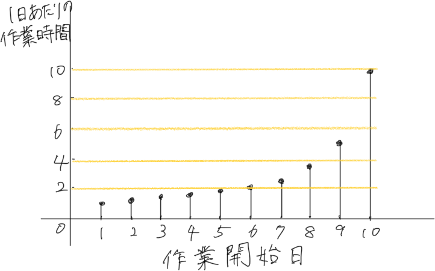

# その問題、数理モデルが解決します

## 本情報

- タイトル：その問題、数理モデルが解決します
- URL：[https://www.amazon.co.jp/dp/4860645685/](https://www.amazon.co.jp/dp/4860645685/)

    

## 序：モデルとは何か？

- 傘を持っていくモデルについて考える
- 最初のモデル
    - 前提条件
        - 行動の選択肢は「傘を持っていく」 or 「傘を持っていかない」
        - 天気は「雨」 or 「晴れ」の2つのみ
        - 雨に濡れるコストは$-10$。傘を持っていくコストは$-2$（雨に濡れるコストの$-1/5$）
        - 雨の確率は$0.6$
    - 期待値
        - 傘を持っていく：$0.4 \times (-2) + 0.6 \times (-2) = -2$
        - 傘を持っていかない：$0.4 \times 0 + 0.6 \times (-10) = -6$
    - 分かったこと
        - 傘を持っていった方が良い
- 一般化モデル
    - 前提条件
        - 雨の確率は$p$、晴れの確率を$1-p$とする
    - 期待値
        - 傘を持っていく：$(1-p) \times (-2) + p \times (-2) = -2$
        - 傘を持っていかない：$(1-p) \times 0 + p \times (-10) = -10p$
    - 分かったこと
        - 雨の確率$p > 0.2$のときに、傘を持っていった方が良い
- さらに一般化モデル
    - 前提条件
        - 雨に濡れるコストを$-c$（$c>0$）
        - 傘を持っていくコストを$-ac$（$0<a<1$）
    - 期待値
        - 傘を持っていく：$(1-p) \times (-ac) + p \times (-ac) = -ac$
        - 傘を持っていかない：$(1-p) \times 0 + p \times (-c) = -pc$
    - 分かったこと
        - 雨の確率$p > a$のときに、傘を持っていった方が良い
- まとめ
    - 「モデル」とは、**現実世界を単純化・抽象化したもの**であり、明確な仮定からなる
    - モデルの目的は、**単純な原理から現実を説明すること**

## 第１章：隠された事実を知る方法

- 問題
    - 学生の喫煙率を調べたい
    - なお、校内は全面禁煙である
- 手順
    - コインを投げる（質問者は結果を見ない）
    - コインが表の場合、正直に答える。裏の場合、「はい」を答える
- 考え方
    - 対象者を集団に分ける
        - A：コインで表が出た人たち
        - B：コインで裏が出た人たち
        - C：Aの中で煙草を吸った人たち
        - D：Bの中で煙草を吸った人たち
        

    - 数値例
        - 調査対象者数：1000人
            - $| A \cup B | = 1000$
        - 理想的なコインを用いた場合、コインが表となる確率は50%
            - $| A | = 500$, $| B | = 500$
        - アンケートに「はい」と答えた人数：600人
            - $| B \cup C | = 600$
        

        - $B$と$C$は互いに背反であるため
            - $| C | = | B \cup C | - | B | = 100$
        - グループ$A$の中での喫煙率は$\frac{| C |}{| A |} = 0.2$
        - 全体の喫煙率も20%となる
- まとめ
    - 正直な回答に抵抗のある質問（喫煙、飲酒、犯罪など）から得たデータには、バイアスが存在する可能性がある
    - 回答のランダム化により、バイアスが取り除かれ、正直な回答に近い比率で推定できる

## 第２章：卒業までに彼氏ができる確率

- 前提条件
    - 確率$p$で好きになる（$X = 1$）
    - 確率$1-p$で好きにならない（$X = 0$）
        - 上記のとき、確率変数$X$は**ベルヌーイ分布にしたがう**という
    - $n$人と出会い、$x$人から好かれる確率を計算したい
    - 状態は「好きになる」「好きにならない」の2つのみ
    - すべての男性は同じ確率$p$であなたを好きになる
- $n = 3$の場合
    - 確率変数$X_1$が男性1を表す
        - $X_1 = 1$：男性1があなたを好きになる
        - $X_1 = 0$：男性1があなたを好きにならない
        - 確率で表すと
            - $P(X_1 = 1) = p$
            - $P(X_1 = 0) = 1 - p$
    - $X_2$、$X_3$についても同様

| 事象   | 0人に好かれる | 1人に好かれる   | 2人に好かれる | 3人に好かれる |
| ------ | ------------- | --------------- | ------------- | ------------- |
| 実現値 | X = 0           | X = 1           | X = 2         | X = 3         |
| 確率   | $(1 - p) ^ 3$ | $3p(1 - p) ^ 2$ | $3p^2(1 - p)$ | $3p^3$        |

- $n$人の場合
    - 誰からも好かれない確率
        - $(1 - p)^n$
        - $n = 50$、$p = 0.05$の場合、$(1 - 0.05)^{50} = 0.95^{50} \approx 0.076$
        - だいたい8%
        - 逆に1人以上から好かれる確率は92%
    - コンビネーション
        - $n$個の中から$x$個を取り出す組み合わせの総数は
        - ${}_n C _x = \binom{n}{x} = \frac{n!}{x!(n - x)!}$
        - $n = 3$、$x = 1$の場合
            - ${}_3 C _1 = \frac{3!}{1!(3 - 1)!} = \frac{3 \times 2 \times 1}{1 \times 2 \times 1} = 3$
    - $n$人のうち$x$人から好かれる組み合わせ
        - ${}_n C _x$
    - $n$人のうち$x$人から好かれる確率
        - $p^x (1-p)^{n - x}$
    - $n$人のうち自分を好きになる人数を$X$とする
        - $X = X_1 + X_2 + \cdots + X_n$
    - 最終的な確率
        - $P(X = x) = {}_n C _x p^x (1-p)^{n - x}$
        - 確率関数の実現値を確率に対応させる関数を**確率関数**という
        - 確率関数${}_n C _x p^x (1-p)^{n - x}$によって定義される確率変数がしたがう分布を**二項分布**という
- まとめ
    - 簡単な具体例から始めて、徐々に一般化する（$n = 3$から始める）
        - 計算が簡単
        - モデルの構造を把握しやすい
    - はじめは単純なモデルを作り、少しずつ複雑な（現実に即した）モデルにする（好きになる確率を男性ごとに変えるなど）
        - 最初から複雑にするとモデルが完成しない可能性がある

## 第３章：内定をもらう方法

- ２章と同じ方法で計算
    - 前提条件
        - 1社あたり0.05の確率で内定が出る
        - 確率変数$X$を$n$社受けて獲得した内定の総数と定義
    - 100社受けた場合
        - $P(X = 0) = 0.95^{100} \approx 0.006$
        - $P(X \geq 1) = 1 - P(X = 0) \approx 0.994$
    - 50社受けた場合
        - $P(X = 0) = 0.95^{50} \approx 0.077$
        - $P(X \geq 1) = 1 - P(X = 0) \approx 0.923$
    - 10社受けた場合
        - $P(X = 0) = 0.95^{10} \approx 0.599$
        - $P(X \geq 1) = 1 - P(X = 0) \approx 0.401$
- 二項分布の期待値
    - パラメータ$n$、$p$の二項分布にしたがう確率変数$X$の期待値
        - $\mathbb{E}[X] = np$
    - 証明
        - $\mathbb{E}[X] = \sum_{x=0}^n x \cdot P(X = x) = \sum_{x=0}^n x \cdot {}_n C_x p^x (1-p)^{n-x}$
        - 期待値の性質
            - 確率変数の和の期待値は、個々の期待値の和に等しい
            - $\mathbb{E}[X] = \mathbb{E}[X_1] + \mathbb{E}[X_2] + \cdots \mathbb{E}[X_n]$
        - 企業$i$についての$X_i$の期待値
            - $\mathbb{E}[X_i] = 0 \times (1-p) + 1 \times p = p$
        - 確率変数$X$の期待値
            - $\mathbb{E}[X] = \mathbb{E}[X_1] + \mathbb{E}[X_2] + \cdots \mathbb{E}[X_n] = p + p + \cdots + p = np$
- ここまでで分かったこと
    - 二項分布で分かったこと
        - $p$が大きいほど、内定をくれる企業の平均数は大きくなる
        - $n$が大きいほど、内定をくれる企業の平均数は大きくなる
    - 内定をもらうための戦略
        - $p$を増やす：自分の魅力を上げる
        - $n$を増やす：より多くの企業にエントリーする
    - 実行可能性
        - $n = 10$、$p = 0.01$の条件のとき、1社以上から内定をもらう確率は
            - $P(X \geq 1) = 1 - (1 - 0.01)^{10} \approx 0.096$
        - $n = 10$、$p = 0.05$の条件のとき、1社以上から内定をもらう確率は
            - $P(X \geq 1) = 1 - (1 - 0.05)^{10} \approx 0.401$
        - $p = 0.01$のままで、上記と同じ確率にするためには$52$社にエントリーする必要がある
            - $P(X \geq 1) = 1 - (1 - 0.01)^{52} \approx 0.407$
- モデルの拡張
    - 企業ごとに採用確率が異なるモデルを考える
    - ベータ分布
        - $p_i$を企業$i$が採用する確率とする
        - $p$の分布として、$[0, 1]$内の連続分布を考える
        - ここでは、連続分布の一つである**ベータ分布**で考えてみる
            - パラメータ$a > 0$、$b > 0$を持つ確率密度関数
            - $f(x) = \left\{\begin{matrix} \frac{1}{{\rm B}(a, b)} x^{a-1} (1-x)^{b-1} && 0 \leq x \leq 1 \\  0 && x < 0 \,\, {\rm or} \,\, x > 1 \end{matrix}\right.$
            - ${\rm B}(a, b) = \int_0^1 t^{a-1} (1-t)^{b-1} {\rm d}t$を**ベータ関数**という
        

    - モデル
        - 前提条件
            - $X \sim {\rm Bin}(n, p)$
            - $p \sim {\rm Beta}(a, b)$
                - ${\rm Bin}$は二項分布（binomial distribution）の略
        - $x$と$p$の同時確率分布$f(x, p)$を求める
            - $f(x, p) = f(x \mid p) f(p) = {}_n C_x p^x (1-p)^{n-x} \cdot \frac{1}{{\rm B}(a, b)} p^{a-1} (1-p)^{b-1}$
        - 確率変数$X$だけの分布を取り出す
            - $f(x) = \int_0^1 f(x, p) {\rm d}p$
                - $= \int_0^1 {}_n C_x p^x (1-p)^{n-x} \cdot \frac{1}{{\rm B}(a, b)} p^{a-1} (1-p)^{b-1} {\rm d}p$
                - $= \frac{1}{{\rm B}(a, b)} {}_n C_x \int_0^1 p^x (1-p)^{n-x} p^{a-1} (1-p)^{b-1} {\rm d}p$
                - $= \frac{1}{{\rm B}(a, b)} {}_n C_x \int_0^1 p^{x+a-1} (1-p)^{n-x+b-1} {\rm d}p$
                - $= {}_n C_x \frac{{\rm B}(a+x, b+n-x)}{{\rm B}(a, b)}$
        - パラメータ$p$がベータ分布にしたがう場合、$n$社受けて$x$社から内定を得られる確率
            - $P(X = x) = {}_n C_x \frac{{\rm B}(a+x, b+n-x)}{{\rm B}(a, b)}$
            - この分布を**ベータ二項分布**という
- まとめ
    - モデルを人間の行動に当てはめた場合に、パラメータを変化させる実行可能性はパラメータごとに異なってくる

## 第４章：先延ばしをしない方法

- モチベーションとは
    - 心理学者のピアーズ・スティールによるモチベーションの定義
        - $モチベーション = \frac{期待 \times 価値}{衝動性 \times 遅れ}$
    - 筆者の定義
        - $モチベーション = \frac{達成確率 \times 価値}{衝動性 \times 締め切りまでの時間}$
- 衝動性によってサボってしまった場合に、未来の自分がどのくらい苦しむことになるか
    - 前提
        - ある課題を仕上げるのに10時間必要
        - 提出期限は10日後
        - 1日あたりの作業時間は、1時間/日となる
    - サボってしまった場合
        - 1日サボってしまった場合
            - $\frac{10時間}{10日 - 1日} \approx 1.11時間/日$
        - 2日サボってしまった場合
            - $\frac{10時間}{10日 - 2日} = 1.25時間/日$
        - $t$日サボってしまった場合
            - $\frac{10時間}{10日 - t日}$
        

- 時間割引
    - 未来に受け取る予定の利得は現在の価値よりも割り引かれる
        - 以下の状況を考える
            - A: 今すぐ1万円もらう
            - B: 1ヶ月後に1万円もらう
        - 現在の価値に対する1期先の価値の割合を$0 < \delta < 1$とする
        - $\delta$を**時間割引因子**という
        - $\delta = 0.9$の場合、1ヶ月先の1万円は現在の9000円と等しいことになる
    - 先延ばしについて考える
        - 作業時間というコストには、1日あたり$\delta = 0.88$の時間割引因子がかかると仮定する
        - 1日サボって2日目から作業を開始する場合
            - 客観的な1日あたりの作業時間：$\frac{10時間}{10日 - 1日} \approx 1.11時間/日$
            - 割引後の1日あたりの作業時間：$\delta \times 1.11 \approx 0.98$
            - 1日目に作業を開始する場合よりも作業時間が短いため、サボる
        - 2日サボって3日目から作業を開始する場合
            - 客観的な1日あたりの作業時間：$\frac{10時間}{10日 - 2日} = 1.25時間/日$
            - 割引後の1日あたりの作業時間：$\delta^2 \times 1.25 \approx 0.968$
            - 1日目に作業を開始する場合よりも作業時間が短いため、サボる
        - $t$日サボって$t+1$日目から作業を開始する場合
            - 客観的な1日あたりの作業時間：$\frac{10}{10 - t}$
            - 割引後の1日あたりの作業時間：$\delta^t \times \frac{10}{10 - t}$
        - $t = 4$の場合
            - $0.88^4 \times \frac{10}{10 - 4} \approx 0.999$
        - $t = 5$の場合
            - $0.88^5 \times \frac{10}{10 - 5} \approx 1.055$
            - $t = 5$のとき初めて割引後の1日あたりの作業時間が1を超える
            - つまり、初日の時点で最初の4日サボり、5日目から作業を始めようと考える

## 第５章：理想の部屋を探す方法

- グーゴル・ゲーム
    - 10枚の紙片に好きな数字を書き、裏返して置く
    - 対戦相手は1枚ずつめくり、めくった紙片が最大値だと思ったらめくるのを止める
    - 最後にめくった紙片が最大値と一致していたら勝ち
- 問題の構造
    - 理想の部屋を探す方法もグーゴル・ゲームも以下の問題の構造をしている
        1. $n$個の対象をランダムな順番で観察する
        1. 対象を観察した際に、それを選ぶかどうか決める
        1. $n$個の対象に対して完全に順序付けができる
        1. 1度パスした対象は選べない
        - 3.と4.は状況によっては、部屋探しの場合には当てはまらないと思うけど、ここでは目をつむる
    - 上記の条件下で1位となるものを探し当てる確率を最大化する問題と考えることができる
        - 4.の条件により、全部観察してから1位を選ぶことはできない
- 確率を考える
    - 前提
        - 10人の中から結婚相手を1人選ぶ
    - 5人まで観察して、6人目が1位である確率
        - $\frac{9}{10} \times \frac{8}{9} \times \frac{7}{8} \times \frac{6}{7} \times \frac{5}{6} \times \frac{1}{5} = \frac{1}{10}$
        - 当てずっぽうに1人選ぶのと変わらない
    - 観察から得た情報を生かす
        - 5人までの暫定1位を基準にして、その1位を超える人が現れたら選ぶ
        - 失敗する条件
            - 最初の5人の中に1位の人がいる場合
            - 最初の5人の中に3位がいて、1位より先に2位の人が現れた場合
        - 成功する条件
            - 全体1位の位置を$j$番目とする
            - $j$は6番目以降にいる
            - $(j - 1)$番目までの暫定1位が、最初の5人までに現れている
        - 成功する確率
            - $(j - 1)$番までの暫定1位が5番目までに含まれ、かつ$j$番目に1位がいる確率
                - $\frac{5}{j - 1} \times \frac{1}{10}$
            - $j$は6番目から10番目まであり得るので、その確率を足し合わせる
                - $\sum_6^{10}\frac{5}{j - 1} \times \frac{1}{10} = \frac{5}{10} \sum_6^{10}\frac{1}{j-1} \approx 0.372817$
        - 一般化
            - 手順
                - $n$人にランダムな数値を割り当てる
                - $r$人まで探索して最大値を記憶する
                - $(r + 1)$人目以降に、その最大値を超える相手が現れたらその人を選ぶ
                - 選んだ相手が最大値であった場合は成功、そうでなかった場合は失敗
            - 成功する確率
            

## 第６章：アルバイトの配属方法

- 選好
    - アルバイトの集合を$N = \left \{ 1, 2, 3 \right \}$
    - 店舗の集合を$S = \left \{ A, B, C \right \}$
    - アルバイト$i$が店舗$A$を店舗$B$より好むことを$A \succ _i B$と書く
    - 選好の定義
        - 個人$i$が持つ、対象への好ましさの順序を**選好**と呼び、$\succ _i$で表す
        - 選好は推移性を満たす
            - $A \succ _i B$かつ$B \succ _i C$ならば$A \succ _i C$
        - $\succ _i: ABC$と書いた場合は、$A \succ _i B$かつ$B \succ _i C$を意味する
- DAアルゴリズム（Deffered Acceptance）
    - 前提
        - アルバイト1の選好：$\succ _1: BAC$
        - アルバイト2の選好：$\succ _2: ACB$
        - アルバイト3の選好：$\succ _3: BCA$
        - 店舗$A$の選好：$\succ _A: 123$
        - 店舗$B$の選好：$\succ _B: 213$
        - 店舗$C$の選好：$\succ _C: 321$
    - ステップ
        - ステップ1：各アルバイトが第一希望の店舗を表明する
            - アルバイト1→$B$
            - アルバイト2→$A$
            - アルバイト3→$B$
        - ステップ2：2名以上から申し込まれた店舗は、その申込者の中から一番望ましい人を選ぶ
            - 店舗$B$の選好は$\succ _B: 213$なので、アルバイト1を選ぶ
        - ステップ3：次に選好する店舗に申し込む
            - アルバイト3→$C$
        - ステップ4：マッチング完了
            - $(1, B), (2, A), (3, C)$
    - 手順
        1. 各アルバイトが第一希望の店舗へと申し込む
        1. この時点で1対1マッチングが完成したら、そこで終了。完成しない場合は次に進む
        1. 2名以上から申し込まれた店舗がある場合は、その店舗は申込者の中で一番望ましい人を残し、その他の人は断る
        1. 希望先の店舗から断られてたアルバイトは次に希望する店舗へ申し込み、手順2に戻る
- マッチングの安定性
    - マッチング$m$が選好$\succ$のもとで安定的であるとは、どのような$(i, j)$によっても$m$がブロックされないことである
    - $m$がブロックされる場合、$m$は不安定であるという
    - DAアルゴリズムは必ず安定的なマッチングを実現する
